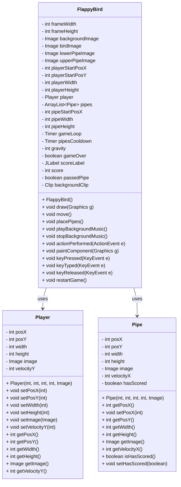

# Tugas Praktikum 6 DPBO 2025 C1  
**Raffi Adzril Alfaiz - Ilmu Komputer UPI**

---

## Janji  
Saya, Raffi Adzril Alfaiz dengan NIM 2308355, mengerjakan Tugas Praktikum 6 dalam mata kuliah Desain dan Pemrograman Berorientasi Objek untuk keberkahan-Nya. Maka saya tidak melakukan kecurangan seperti yang telah dispesifikasikan. Aamiin.

---

## Deskripsi Tugas

Ini adalah game **Flappy Bird** sederhana yang dibuat menggunakan Java `Swing` dan `AWT`. Game ini memiliki sprite khusus, efek suara, dan tampilan skor bergaya retro.

## Desain Program

## Alur Program

1. **Inisialisasi Game**
   - Program dimulai dengan membuat instance dari `FlappyBird`.
   - Properti penting seperti ukuran layar, posisi player, dan resource (gambar, musik) dimuat.
   - Objek `Player` dan `ArrayList<Pipe>` diinisialisasi.

2. **Menampilkan UI**
   - Game window dibuat menggunakan `JFrame` dan ditambahkan panel dari `FlappyBird`.
   - Label skor ditambahkan ke panel.

3. **Memulai Musik dan Timer**
   - Musik latar dimulai menggunakan `Clip` dari Java Sound API.
   - Dua timer diaktifkan:
     - `gameLoop` (20ms interval) → untuk menggambar ulang layar dan menggerakkan objek.
     - `pipesCooldown` (1500ms interval) → untuk menambahkan pipa baru ke dalam game.

4. **Loop Permainan**
   - Pada setiap tick `gameLoop`:
     - `move()` dipanggil untuk:
       - Menggerakkan player berdasarkan gravitasi.
       - Menggerakkan semua pipa ke kiri.
       - Mendeteksi tabrakan dengan pipa atau keluar layar.
       - Mengatur skor saat player berhasil melewati pipa.
     - `repaint()` memanggil `paintComponent()` untuk menggambar ulang objek di layar.

5. **Kontrol Pemain**
   - Menekan tombol spasi (`KeyEvent`) mengurangi kecepatan jatuh (melompat ke atas).
   - Jika `gameOver` bernilai `true`, maka tombol spasi akan memanggil `restartGame()`.

6. **Game Over**
   - Jika player bertabrakan dengan pipa atau menyentuh batas layar:
     - Timer berhenti.
     - Musik dihentikan.
     - `gameOver` di-set menjadi `true`.

7. **Restart Game**
   - Semua pipa dihapus.
   - Player di-reset ke posisi awal.
   - Skor dan kondisi game di-reset.
   - Musik dan timer diaktifkan kembali.

---

## Interaksi Antar Kelas

- `FlappyBird` mengatur seluruh alur program dan menggunakan:
  - `Player`: untuk menyimpan dan mengatur posisi serta gerakan burung.
  - `Pipe`: untuk menyimpan data setiap pipa (posisi, ukuran, gambar).

- Perubahan posisi dan kondisi semua entitas dilakukan melalui metode getter/setter di masing-masing class.

---

## Fitur

- Gameplay klasik Flappy Bird
- Grafik khusus (burung, latar belakang, pipa, dan papan game over)
- Pelacakan skor dengan font bergaya arcade
- Mulai ulang permainan dengan menekan `R` setelah game over

## Kontrol

| Tombol     | Aksi                   |
|------------|------------------------|
| `SPACE`    | Membuat burung melompat dan start game |
| `R`        | Memulai ulang game setelah game over |

## Dokumentasi
[recordGame](RecordingGame.mp4)

[https://github.com/user-attachments/assets/b9b0b2d3-95de-4d8e-a461-ee717a5d70ad](https://github.com/user-attachments/assets/b9b0b2d3-95de-4d8e-a461-ee717a5d70ad)
